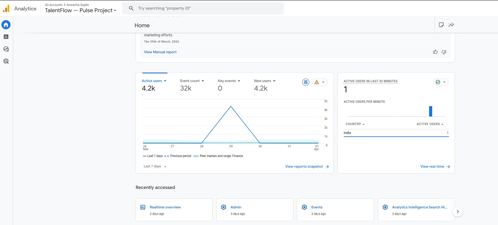
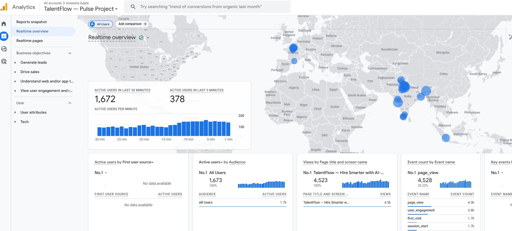
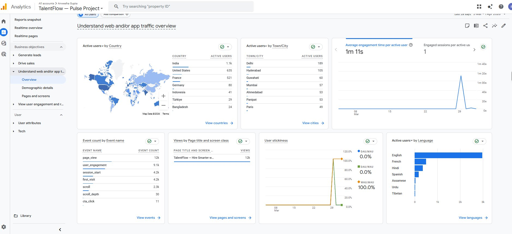
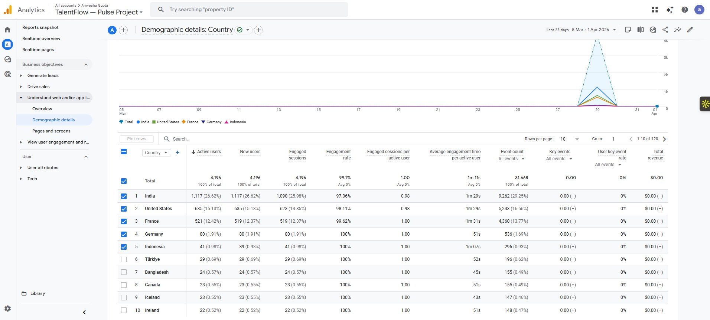
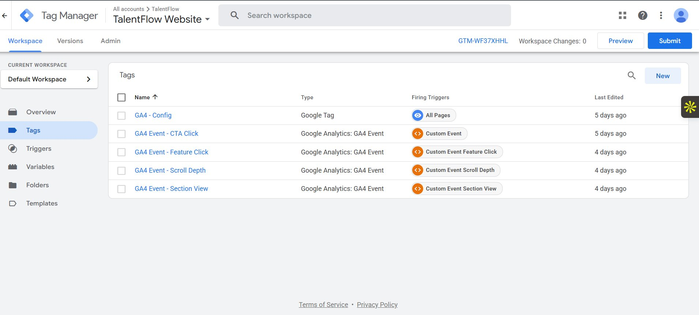
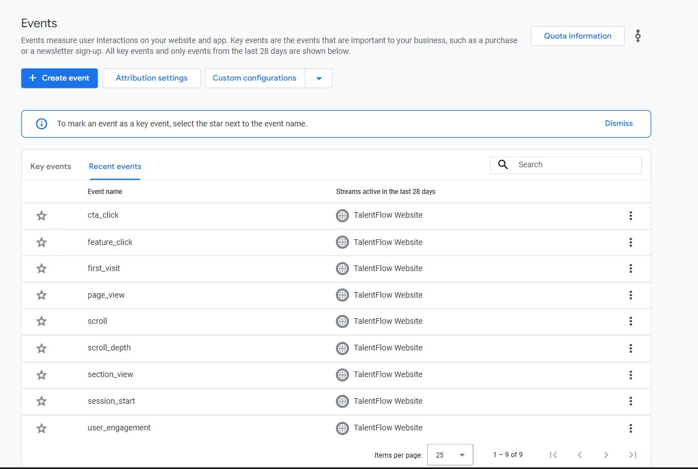
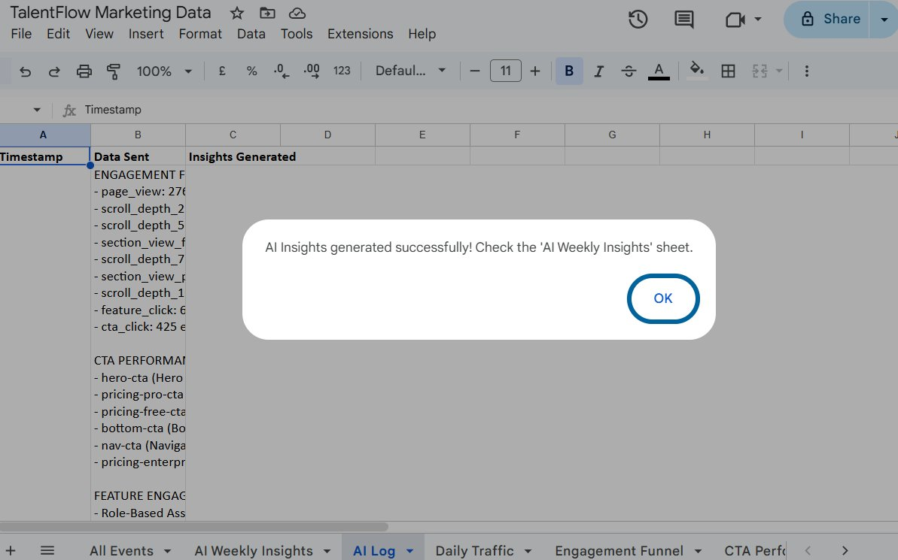
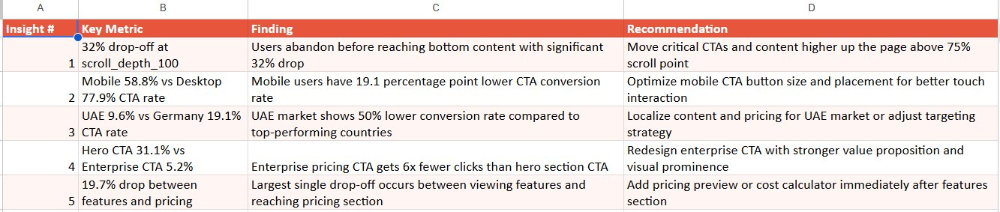

# Pulse — AI-Powered Marketing Analytics Dashboard

## TalentFlow Marketing Intelligence Platform

> A full-stack marketing analytics project demonstrating end-to-end data pipeline design, from event tracking to AI-generated strategic insights — built for a fictional B2B talent assessment SaaS platform.

**[View Live Dashboard →](https://lookerstudio.google.com/reporting/5665f05d-50da-4b63-a4ac-3fd768888a05)**
**[View Landing Page →](https://joyful-salamander-d7459d.netlify.app/)**

---

## Project Walkthrough

### GA4 Property — 4.2k Users, 32k Events Tracked


### Real-Time Tracking — 1,672 Concurrent Users


### GA4 Traffic Overview — Multi-Country Reach with Engagement Metrics


### GA4 Demographic Details — 120 Countries, Detailed Engagement Breakdown


### Google Tag Manager — 5 Tags Configured (GA4 Config + 4 Custom Events)


### GA4 Custom Events — All 9 Events Active and Tracking


### Dashboard Page 1 — Acquisition Overview


### Dashboard Page 2 — Engagement Funnel


### Dashboard Page 3 — Content Performance


### AI Insights — Generated via Claude API


### Dashboard Page 4 — AI Weekly Insights Display


---

## What This Project Demonstrates

This is not a standard analytics dashboard. Pulse is a **complete marketing intelligence system** that collects behavioral data, processes it through a structured pipeline, and uses **AI to generate actionable business recommendations** — replacing hours of manual analysis with automated, data-driven insights.

### The AI Layer

The core differentiator is the **Claude API integration** that reads raw marketing data and produces strategic recommendations a marketing team can act on immediately.

**How it works:**
- Google Apps Script reads from 5 analytics data sheets (Engagement Funnel, CTA Performance, Feature Engagement, Device Performance, Country Performance)
- A structured prompt sends this data to the **Claude API** with specific instructions for B2B SaaS marketing analysis
- Claude returns 5 prioritized insights with exact metrics and implementable recommendations
- Results are written back to Google Sheets and displayed in the Looker Studio dashboard
- The entire pipeline runs with a single click from the Google Sheets menu

**Example AI-generated insight:**
> "Mobile drives 50.1% of traffic but has a 24.4% lower CTA conversion rate than desktop (58.8% vs 77.9%). Despite high engagement time (322s vs 262s), mobile UX barriers are preventing conversions."
>
> **Recommendation:** Implement mobile-specific CTA optimization — increase button size, reduce form fields, and add one-click demo scheduling.

This approach transforms a passive dashboard into an **active decision-making tool**.

---

## Architecture

```
Landing Page (Netlify)
        │
        ▼
Google Tag Manager ──→ Custom Event Tracking
        │                  • cta_click (6 buttons tracked individually)
        ▼                  • scroll_depth (25%, 50%, 75%, 100%)
Google Analytics 4         • section_view (features, pricing)
        │                  • feature_click (4 feature cards)
        ▼
Google Sheets (Data Layer)
        │
        ├──→ Looker Studio Dashboard (4 pages)
        │        • Acquisition Overview
        │        • Engagement Funnel
        │        • Content Performance
        │        • AI Weekly Insights
        │
        └──→ Google Apps Script
                    │
                    ▼
              Claude API (AI Analysis)
                    │
                    ▼
              Automated Insights → Back to Google Sheets → Looker Studio
```

---

## Dashboard Pages

### Page 1: Acquisition Overview
Answers: **"Where are visitors coming from?"**
- Traffic source distribution (organic, social, direct, referral)
- Users over time with growth trends
- Device category breakdown
- Key finding: mobile dominates traffic but desktop engagement is significantly higher

### Page 2: Engagement Funnel
Answers: **"Where do users drop off?"**
- Full funnel from page_view (2,768) → cta_click (425)
- Step-by-step drop-off analysis
- Key finding: 32% drop-off between scroll_depth_75 and scroll_depth_100 indicates bottom-page content needs optimization

### Page 3: Content Performance
Answers: **"Which content gets attention?"**
- CTA button performance (hero CTA captures 30% of all clicks)
- Feature card engagement (AI Candidate Scoring and Role-Based Assessments dominate with 63.9%)
- Device-level conversion comparison
- Key finding: pricing section CTAs combined (41.9%) outperform hero CTA (31.1%)

### Page 4: AI Weekly Insights
Answers: **"What should we do next?"**
- 5 AI-generated insights from Claude API
- Each insight includes: specific metric, data-backed finding, implementable recommendation
- Powered by automated Google Apps Script pipeline

---

## Technical Stack

| Layer | Tool | Purpose |
|-------|------|---------|
| Landing Page | HTML/CSS/JS, Netlify | Realistic SaaS product page |
| Tag Management | Google Tag Manager | Event tracking without code changes |
| Analytics | Google Analytics 4 | Behavioral data collection |
| Data Layer | Google Sheets | Structured data storage |
| Visualization | Looker Studio | Interactive dashboard |
| Automation | Google Apps Script | Pipeline orchestration |
| AI | Claude API (Anthropic) | Automated insight generation |

---

## Custom Events Tracked

| Event | What It Tracks | Why It Matters |
|-------|---------------|----------------|
| `cta_click` | Every CTA button with location ID | Measures conversion intent by page position |
| `scroll_depth` | 25%, 50%, 75%, 100% thresholds | Maps attention decay through the page |
| `section_view` | Features and Pricing sections | Identifies which content blocks get seen |
| `feature_click` | Individual feature card clicks | Reveals which product capabilities interest users |

---

## AI Insights Pipeline — Code

The Google Apps Script (`apps_script_ai_insights.js`) in this repository:
1. Reads data from 5 analytics sheets
2. Constructs a structured prompt with all key metrics
3. Calls the Claude API with specific formatting instructions
4. Parses the response into structured columns (Insight #, Key Metric, Finding, Recommendation)
5. Writes results to a dedicated sheet that Looker Studio displays

The prompt is engineered to produce insights specific to B2B SaaS marketing operations — not generic analytics observations.

---

## Key Skills Demonstrated

- **Marketing Analytics**: GA4 property configuration, custom event design, conversion tracking
- **Tag Management**: GTM container setup with custom triggers and tags
- **Dashboard Design**: Multi-page Looker Studio dashboard with data storytelling
- **AI Integration**: Claude API integration for automated analysis
- **Automation**: Google Apps Script pipeline connecting data to AI to visualization
- **Data Architecture**: Multi-source data pipeline (GA4 → Sheets → AI → Looker Studio)

---

## Repository Contents

```
├── README.md                       # Project documentation
├── talentflow-landing-page.html    # Landing page with GTM + event tracking
├── apps_script_v2.js               # Google Apps Script for Claude API integration
├── talentflow_final.xlsx           # Sample marketing dataset (21,346 rows)
└── screenshots/                    # Project walkthrough images
    ├── 01-ga4-home-overview.png
    ├── 02-ga4-traffic-overview.png
    ├── 03-ga4-demographic-details.png
    ├── 04-gtm-tags-configured.png
    ├── 05-ga4-realtime-1672-users.png
    ├── 06-ga4-custom-events.png
    ├── 07-dashboard-page1-acquisition.png
    ├── 08-dashboard-page2-funnel.png
    ├── 09-dashboard-page3-content.png
    ├── 10-ai-insights-generated.png
    └── 11-dashboard-page4-ai-insights.png
```

---

## About This Project

Built by **Anwesha Gupta** as a portfolio project demonstrating marketing operations and AI-powered analytics capabilities. The project simulates a real-world scenario where a marketing team at a B2B SaaS company uses data and AI to optimize their acquisition funnel.

**Contact:** [Your LinkedIn] | [Your Email]
